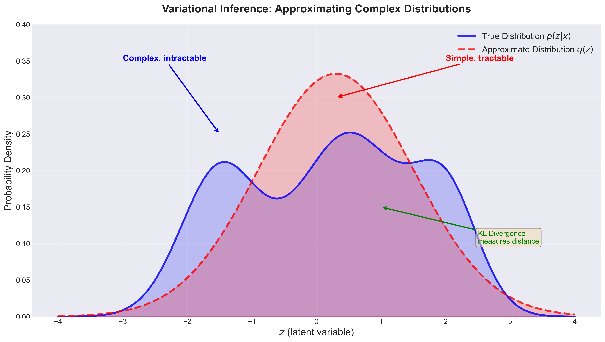
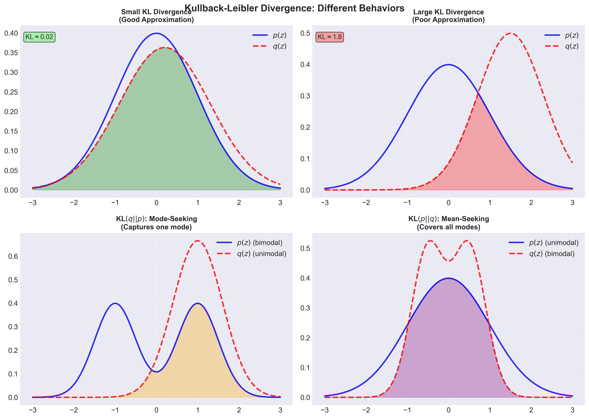
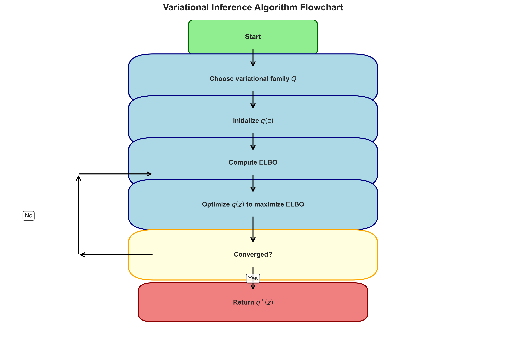
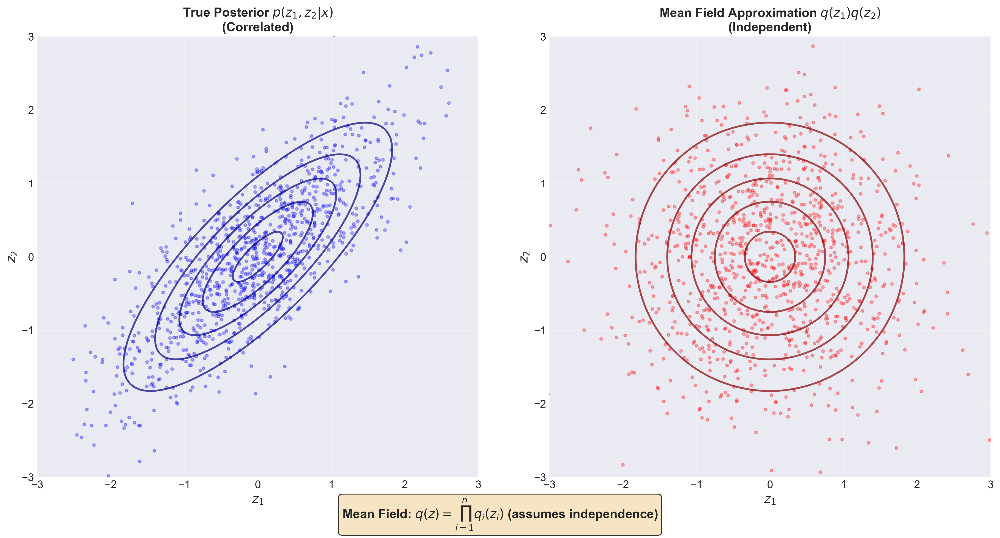
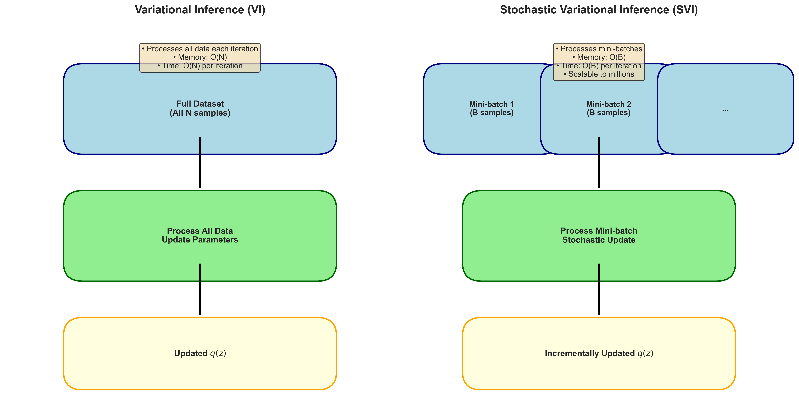
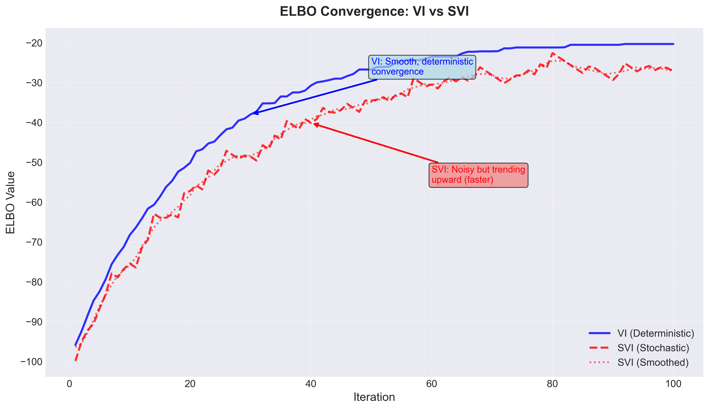
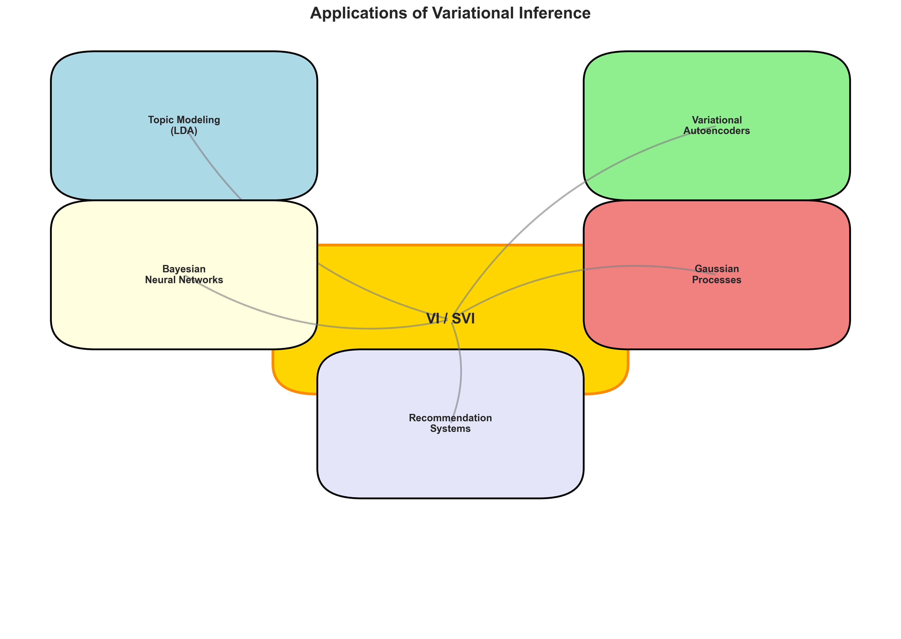

# Variational Inference and Stochastic Variational Inference

A comprehensive guide to understanding Variational Inference (VI) and Stochastic Variational Inference (SVI) from first principles to advanced applications.

## Table of Contents

1. [Introduction - The Simple Explanation](#introduction---the-simple-explanation)
2. [What is Variational Inference?](#what-is-variational-inference)
3. [The Problem VI Solves](#the-problem-vi-solves)
4. [How Variational Inference Works](#how-variational-inference-works)
5. [Mathematical Foundations](#mathematical-foundations)
6. [Stochastic Variational Inference (SVI)](#stochastic-variational-inference-svi)
7. [Key Algorithms](#key-algorithms)
8. [Applications](#applications)
9. [Advantages and Limitations](#advantages-and-limitations)
10. [Code Examples](#code-examples)
11. [Visualizations](#visualizations)
12. [Further Reading](#further-reading)

---

## Introduction - The Simple Explanation

### What is Variational Inference? (Simple Version)

Imagine you're trying to understand a complex system, but you can't observe everything directly. For example:
- You want to know what topics are in a collection of documents, but you can only see the words
- You want to understand customer preferences, but you only see their purchases
- You want to model the spread of a disease, but you only see reported cases

**Variational Inference (VI)** is a clever way to approximate the true, complex distribution of hidden variables by using a simpler, easier-to-work-with distribution.

**Think of it like this:**
- The true distribution is like a complex, irregularly shaped mountain
- VI finds a simpler "mountain" (like a smooth hill) that's close enough to the real one
- This simpler mountain is much easier to work with mathematically


*Figure 1: Variational Inference approximates a complex distribution (blue) with a simpler one (red). The KL divergence measures how close they are.*

### What is Stochastic Variational Inference? (Simple Version)

**Stochastic Variational Inference (SVI)** is like VI, but it works with data in small batches instead of all at once.

**Why is this useful?**
- When you have millions of documents, you can't process them all at once
- SVI processes data in small chunks (mini-batches)
- It updates the approximation incrementally as it sees more data
- This makes it scalable to huge datasets

**Real-world analogy:**
- Regular VI is like reading an entire library to understand literature
- SVI is like reading a few books at a time, updating your understanding as you go

---

## What is Variational Inference?

Variational Inference is a method for approximating complex probability distributions. It's particularly useful in Bayesian statistics and machine learning when dealing with:

- **Posterior distributions** that are intractable (can't be computed exactly)
- **Latent variable models** where we need to infer hidden variables
- **Probabilistic models** with complex dependencies

### The Core Idea

Instead of trying to compute the exact posterior distribution \(p(z|x)\) (which is often impossible), VI finds an approximate distribution \(q(z)\) from a family of simpler distributions \(Q\) that is "close" to the true posterior.

The "closeness" is measured using the **Kullback-Leibler (KL) divergence**, which quantifies how different two probability distributions are.


*Figure 2: Different behaviors of KL divergence. Small KL means good approximation, large KL means poor approximation. The direction of KL (q||p vs p||q) affects whether the approximation is mode-seeking or mean-seeking.*

---

## The Problem VI Solves

### The Intractable Posterior Problem

In Bayesian inference, we often want to compute:

\[
p(z|x) = \frac{p(x|z) \cdot p(z)}{p(x)}
\]

Where:
- \(z\) = latent (hidden) variables
- \(x\) = observed data
- \(p(z|x)\) = posterior distribution (what we want)
- \(p(x|z)\) = likelihood
- \(p(z)\) = prior
- \(p(x)\) = evidence (marginal likelihood)

**The problem:** Computing \(p(x) = \int p(x|z) \cdot p(z) dz\) often requires an intractable integral, especially in high-dimensional spaces.

### Why Traditional Methods Fail

1. **Analytical solutions**: Only work for conjugate priors (limited cases)
2. **Markov Chain Monte Carlo (MCMC)**: Can be slow, especially for large datasets
3. **Grid methods**: Don't scale to high dimensions (curse of dimensionality)

**VI provides a fast, scalable alternative** that trades exactness for speed and scalability.

---

## How Variational Inference Works

### Step-by-Step Process

1. **Choose a family of distributions** \(Q\) (e.g., Gaussian distributions)
2. **Find the best approximation** \(q^*(z) \in Q\) that minimizes the KL divergence to the true posterior
3. **Optimize** using gradient-based methods


*Figure 3: Flowchart of the Variational Inference algorithm. The process iteratively optimizes the approximate distribution until convergence.*

### The Variational Objective

VI transforms the intractable problem into an optimization problem:

\[
q^*(z) = \arg\min_{q \in Q} \text{KL}(q(z) \| p(z|x))
\]

However, we can't compute this directly because we don't know \(p(z|x)\). Instead, VI maximizes the **Evidence Lower BOund (ELBO)**:

\[
\text{ELBO}(q) = \mathbb{E}_{q(z)}[\log p(x|z)] - \text{KL}(q(z) \| p(z))
\]

Maximizing ELBO is equivalent to minimizing KL divergence, but ELBO is computable!

### Why ELBO Works

The relationship between ELBO and KL divergence:

\[
\log p(x) = \text{ELBO}(q) + \text{KL}(q(z) \| p(z|x))
\]

Since \(\log p(x)\) is constant (doesn't depend on \(q\)), maximizing ELBO minimizes KL divergence.

---

## Mathematical Foundations

### Kullback-Leibler Divergence

The KL divergence measures how one probability distribution differs from another:

\[
\text{KL}(q \| p) = \int q(z) \log \frac{q(z)}{p(z)} dz
\]

**Properties:**
- \(\text{KL}(q \| p) \geq 0\) (always non-negative)
- \(\text{KL}(q \| p) = 0\) if and only if \(q = p\)
- Not symmetric: \(\text{KL}(q \| p) \neq \text{KL}(p \| q)\)

### Evidence Lower Bound (ELBO)

The ELBO decomposes as:

\[
\text{ELBO}(q) = \underbrace{\mathbb{E}_{q(z)}[\log p(x|z)]}_{\text{Reconstruction term}} - \underbrace{\text{KL}(q(z) \| p(z))}_{\text{Regularization term}}
\]

**Interpretation:**
- **Reconstruction term**: How well \(q(z)\) explains the data \(x\)
- **Regularization term**: Penalty for \(q(z)\) deviating from the prior \(p(z)\)

### Mean Field Variational Inference

A common choice for \(Q\) is the **mean field** family, where we assume independence:

\[
q(z) = \prod_{i=1}^{n} q_i(z_i)
\]

This simplifies the optimization by breaking it into independent sub-problems.


*Figure 4: Mean field approximation assumes independence between latent variables. The true posterior (left) shows correlation, while the mean field approximation (right) assumes independence.*

### Coordinate Ascent Variational Inference (CAVI)

For mean field VI, we can optimize each \(q_i(z_i)\) while holding others fixed:

\[
\log q_i^*(z_i) = \mathbb{E}_{-i}[\log p(z_i | z_{-i}, x)] + \text{const}
\]

Where \(\mathbb{E}_{-i}\) denotes expectation over all variables except \(z_i\).

---

## Stochastic Variational Inference (SVI)

### Motivation

Traditional VI requires processing the entire dataset at each iteration, which is:
- **Slow** for large datasets
- **Memory-intensive** (must store all data)
- **Not suitable for streaming data**

SVI addresses these limitations by using **stochastic optimization**.

### Key Idea

Instead of using the full gradient:

\[
\nabla_\lambda \text{ELBO} = \sum_{i=1}^{n} \nabla_\lambda \mathbb{E}_{q(z)}[\log p(x_i|z)]
\]

SVI uses a **stochastic estimate** from a mini-batch:

\[
\nabla_\lambda \text{ELBO} \approx \frac{n}{|B|} \sum_{i \in B} \nabla_\lambda \mathbb{E}_{q(z)}[\log p(x_i|z)]
\]

Where \(B\) is a random mini-batch of data points.


*Figure 5: Comparison between VI (processes full dataset) and SVI (processes mini-batches). SVI enables scalable inference on large datasets.*


*Figure 6: ELBO convergence for VI (smooth) vs SVI (noisy but faster). Both methods maximize ELBO to find the best approximation.*

### Natural Gradients

SVI typically uses **natural gradients** instead of regular gradients. Natural gradients account for the geometry of the probability distribution space.

For exponential family distributions:

\[
\nabla_\lambda^{\text{natural}} \text{ELBO} = \lambda_0 + n \cdot \mathbb{E}_{\phi(x)}[\hat{\lambda}(x)] - \lambda
\]

Where:
- \(\lambda\) = natural parameters of \(q(z)\)
- \(\lambda_0\) = natural parameters of prior \(p(z)\)
- \(\hat{\lambda}(x)\) = sufficient statistics from data

### SVI Algorithm

```
Initialize variational parameters λ
For each iteration:
    1. Sample a mini-batch B from the dataset
    2. Compute local variational parameters φ for each x in B
    3. Compute stochastic natural gradient
    4. Update global parameters: λ ← λ + ρ_t · (natural gradient)
    5. Update step size: ρ_t (using Robbins-Monro conditions)
```

### Step Size Schedule

The step size \(\rho_t\) must satisfy:

\[
\sum_{t=1}^{\infty} \rho_t = \infty \quad \text{and} \quad \sum_{t=1}^{\infty} \rho_t^2 < \infty
\]

A common choice: \(\rho_t = (t + \tau)^{-\kappa}\) where \(\tau > 0\) and \(\kappa \in (0.5, 1]\).

---

## Key Algorithms

### 1. Coordinate Ascent VI (CAVI)

**Algorithm:**
```
Initialize q(z) = ∏ q_i(z_i)
Repeat until convergence:
    For each i:
        q_i(z_i) ∝ exp(E_{-i}[log p(z_i | z_{-i}, x)])
```

**Pros:**
- Simple and interpretable
- Guaranteed to increase ELBO

**Cons:**
- Requires full data pass per iteration
- Can be slow for large datasets

### 2. Stochastic Variational Inference (SVI)

**Algorithm:**
```
Initialize global parameters λ
For t = 1, 2, ...:
    Sample mini-batch B
    For each x in B:
        Optimize local parameters φ(x)
    Compute stochastic natural gradient
    Update: λ ← λ + ρ_t · gradient
```

**Pros:**
- Scalable to large datasets
- Works with streaming data
- Fast convergence

**Cons:**
- Requires careful step size tuning
- More complex implementation

### 3. Automatic Differentiation VI (ADVI)

Uses automatic differentiation to compute gradients, making it applicable to a wide range of models without manual derivations.

### 4. Black Box VI (BBVI)

Uses Monte Carlo estimates of gradients, making it model-agnostic:

\[
\nabla_\lambda \text{ELBO} \approx \frac{1}{S} \sum_{s=1}^{S} \nabla_\lambda \log q(z^{(s)}|\lambda) \cdot [\log p(x, z^{(s)}) - \log q(z^{(s)}|\lambda)]
\]

Where \(z^{(s)} \sim q(z|\lambda)\).

---

## Applications


*Figure 7: Various applications of Variational Inference and Stochastic Variational Inference across different domains.*

### 1. Topic Modeling (Latent Dirichlet Allocation)

**Problem:** Discover topics in a collection of documents

**VI Solution:**
- Latent variables: topic assignments for each word
- Approximate posterior: distribution over topics
- SVI enables scaling to millions of documents

### 2. Variational Autoencoders (VAEs)

**Problem:** Learn generative models of data

**VI Solution:**
- Latent variables: low-dimensional representations
- Approximate posterior: encoder network
- Enables efficient sampling and generation

### 3. Bayesian Neural Networks

**Problem:** Quantify uncertainty in neural network predictions

**VI Solution:**
- Latent variables: network weights
- Approximate posterior: distribution over weights
- Provides uncertainty estimates

### 4. Gaussian Process Models

**Problem:** Non-parametric regression with uncertainty

**VI Solution:**
- Latent variables: function values
- Approximate posterior: sparse GP approximation
- Scales to large datasets

### 5. Probabilistic Matrix Factorization

**Problem:** Collaborative filtering (recommendation systems)

**VI Solution:**
- Latent variables: user and item factors
- Approximate posterior: factor distributions
- Handles missing data naturally

---

## Advantages and Limitations

### Advantages

1. **Scalability**: SVI can handle millions of data points
2. **Speed**: Much faster than MCMC for large datasets
3. **Deterministic**: No sampling randomness (unlike MCMC)
4. **Flexibility**: Works with many model types
5. **Uncertainty quantification**: Provides approximate posterior distributions

### Limitations

1. **Approximation error**: Not exact (unlike MCMC)
2. **Bias**: Mean field assumption can be restrictive
3. **Local optima**: May get stuck in local minima
4. **Model-specific**: Requires choosing appropriate variational family
5. **Hyperparameter tuning**: Step sizes and initialization matter

### When to Use VI vs MCMC

**Use VI when:**
- You have large datasets (>10K points)
- Speed is important
- Approximate uncertainty is acceptable
- You need real-time inference

**Use MCMC when:**
- You need exact posterior samples
- Dataset is small to medium
- Approximation error is unacceptable
- You have time for longer computation

---

## Code Examples

### Example 1: Simple Gaussian Mixture Model with VI

```python
import numpy as np
import scipy.stats as stats
from scipy.optimize import minimize

def elbo_gmm(q_params, data, K, alpha_0, mu_0, lambda_0, nu_0, beta_0):
    """
    Compute ELBO for Gaussian Mixture Model
    """
    pi, mu, sigma = q_params
    
    # Reconstruction term
    recon = 0
    for n in range(len(data)):
        for k in range(K):
            recon += pi[k] * stats.norm.logpdf(data[n], mu[k], sigma[k])
    
    # KL divergence term (simplified)
    kl = np.sum(pi * np.log(pi / (alpha_0 / K)))
    
    return recon - kl

# Example usage
data = np.random.randn(100)
K = 3
q_params = [np.ones(K)/K, np.random.randn(K), np.ones(K)]
result = minimize(lambda p: -elbo_gmm(p, data, K, 1.0, 0.0, 1.0, 1.0, 1.0), 
                  q_params, method='L-BFGS-B')
```

### Example 2: Stochastic Variational Inference for LDA

```python
import numpy as np

class StochasticVI:
    def __init__(self, n_topics, vocab_size, alpha=0.1, eta=0.01):
        self.n_topics = n_topics
        self.vocab_size = vocab_size
        self.alpha = alpha
        self.eta = eta
        
        # Global parameters (topic-word distributions)
        self.lambda_ = np.random.gamma(100, 1/100, (n_topics, vocab_size))
        
    def update_minibatch(self, batch_docs, step_size):
        """
        Update global parameters using a mini-batch
        """
        batch_size = len(batch_docs)
        
        # Compute sufficient statistics from batch
        E_log_beta = self._compute_E_log_beta()
        
        # For each document in batch
        for doc in batch_docs:
            # Optimize local parameters (document-topic distribution)
            gamma = self._optimize_local_params(doc, E_log_beta)
            
            # Compute document-level sufficient statistics
            phi = self._compute_phi(doc, gamma, E_log_beta)
            
            # Accumulate statistics
            self.lambda_ += step_size * (self.eta + phi - self.lambda_)
    
    def _compute_E_log_beta(self):
        """Compute E[log beta] for topics"""
        return (np.digamma(self.lambda_) - 
                np.digamma(self.lambda_.sum(axis=1, keepdims=True)))
    
    def _optimize_local_params(self, doc, E_log_beta):
        """Optimize document-topic distribution (gamma)"""
        # Simplified: fixed-point iteration
        gamma = np.ones(self.n_topics) * self.alpha
        for _ in range(10):  # Iterations
            gamma = self.alpha + np.sum(
                [np.exp(E_log_beta[:, word] + np.digamma(gamma) - 
                       np.digamma(gamma.sum())) 
                 for word in doc], axis=0)
        return gamma
    
    def _compute_phi(self, doc, gamma, E_log_beta):
        """Compute word-topic assignment probabilities"""
        phi = np.zeros((self.n_topics, self.vocab_size))
        for word in doc:
            phi[:, word] = np.exp(E_log_beta[:, word] + 
                                 np.digamma(gamma) - 
                                 np.digamma(gamma.sum()))
            phi[:, word] /= phi[:, word].sum()
        return phi

# Example usage
svi = StochasticVI(n_topics=10, vocab_size=1000)
documents = [np.random.randint(0, 1000, size=100) for _ in range(1000)]

for epoch in range(10):
    # Process in mini-batches
    batch_size = 100
    for i in range(0, len(documents), batch_size):
        batch = documents[i:i+batch_size]
        step_size = (epoch * len(documents) + i + 1) ** -0.7
        svi.update_minibatch(batch, step_size)
```

### Example 3: Variational Autoencoder (Simplified)

```python
import torch
import torch.nn as nn
import torch.nn.functional as F

class VariationalEncoder(nn.Module):
    def __init__(self, input_dim, hidden_dim, latent_dim):
        super().__init__()
        self.fc1 = nn.Linear(input_dim, hidden_dim)
        self.fc2_mu = nn.Linear(hidden_dim, latent_dim)
        self.fc2_logvar = nn.Linear(hidden_dim, latent_dim)
    
    def forward(self, x):
        h = F.relu(self.fc1(x))
        mu = self.fc2_mu(h)
        logvar = self.fc2_logvar(h)
        return mu, logvar

class VariationalDecoder(nn.Module):
    def __init__(self, latent_dim, hidden_dim, output_dim):
        super().__init__()
        self.fc1 = nn.Linear(latent_dim, hidden_dim)
        self.fc2 = nn.Linear(hidden_dim, output_dim)
    
    def forward(self, z):
        h = F.relu(self.fc1(z))
        return torch.sigmoid(self.fc2(h))

class VAE(nn.Module):
    def __init__(self, input_dim, hidden_dim, latent_dim):
        super().__init__()
        self.encoder = VariationalEncoder(input_dim, hidden_dim, latent_dim)
        self.decoder = VariationalDecoder(latent_dim, hidden_dim, input_dim)
    
    def reparameterize(self, mu, logvar):
        """Reparameterization trick"""
        std = torch.exp(0.5 * logvar)
        eps = torch.randn_like(std)
        return mu + eps * std
    
    def forward(self, x):
        mu, logvar = self.encoder(x)
        z = self.reparameterize(mu, logvar)
        recon = self.decoder(z)
        return recon, mu, logvar
    
    def loss_function(self, recon_x, x, mu, logvar):
        """Compute ELBO (negative)"""
        # Reconstruction term (binary cross-entropy)
        recon_loss = F.binary_cross_entropy(recon_x, x, reduction='sum')
        
        # KL divergence term
        kl_loss = -0.5 * torch.sum(1 + logvar - mu.pow(2) - logvar.exp())
        
        return recon_loss + kl_loss

# Example usage
vae = VAE(input_dim=784, hidden_dim=400, latent_dim=20)
optimizer = torch.optim.Adam(vae.parameters(), lr=1e-3)

# Training loop
for epoch in range(10):
    for batch_idx, (data, _) in enumerate(dataloader):
        optimizer.zero_grad()
        recon_batch, mu, logvar = vae(data)
        loss = vae.loss_function(recon_batch, data, mu, logvar)
        loss.backward()
        optimizer.step()
```

---

## Visualizations

This repository includes several visualizations to help understand VI and SVI concepts:

1. **[VI Concept Diagram](images/vi_concept.png)**: Shows how VI approximates complex distributions
2. **[VI Algorithm Flowchart](images/vi_algorithm_flowchart.png)**: Step-by-step algorithm visualization
3. **[VI vs SVI Comparison](images/vi_vs_svi_comparison.png)**: Side-by-side comparison of approaches
4. **[ELBO Convergence](images/elbo_convergence.png)**: Convergence behavior comparison
5. **[Mean Field Approximation](images/mean_field_approximation.png)**: Visualization of independence assumption
6. **[Applications Overview](images/applications_overview.png)**: Real-world use cases
7. **[KL Divergence Visualization](images/kl_divergence_visualization.png)**: Different behaviors of KL divergence

For detailed descriptions of each image, see [ILLUSTRATIONS.md](ILLUSTRATIONS.md).

To regenerate all visualizations, run:
```bash
python scripts/generate_visualizations.py
```

---

## Further Reading

### Foundational Papers

1. **Variational Inference:**
   - Jordan, M. I., Ghahramani, Z., Jaakkola, T. S., & Saul, L. K. (1999). "An introduction to variational methods for graphical models." *Machine Learning*, 37(2), 183-233.

2. **Stochastic Variational Inference:**
   - Hoffman, M. D., Blei, D. M., Wang, C., & Paisley, J. (2013). "Stochastic variational inference." *Journal of Machine Learning Research*, 14(1), 1303-1347.

3. **Variational Autoencoders:**
   - Kingma, D. P., & Welling, M. (2013). "Auto-encoding variational bayes." *arXiv preprint arXiv:1312.6114*.

### Books and Tutorials

1. Bishop, C. M. (2006). *Pattern Recognition and Machine Learning*. Chapter 10: Approximate Inference.

2. Murphy, K. P. (2022). *Probabilistic Machine Learning: Advanced Topics*. Chapter 21: Variational Inference.

3. Blei, D. M., Kucukelbir, A., & McAuliffe, J. D. (2017). "Variational inference: A review for statisticians." *Journal of the American Statistical Association*, 112(518), 859-877.

### Software Libraries

1. **Pyro** (PyTorch): Probabilistic programming with VI
2. **Edward2/TensorFlow Probability**: Probabilistic modeling
3. **Stan**: Bayesian inference (includes VI)
4. **scikit-learn**: Variational Bayesian methods
5. **gensim**: SVI for topic modeling

### Online Resources

- [Variational Inference Tutorial](https://www.cs.princeton.edu/courses/archive/fall11/cos597C/lectures/variational-inference-i.pdf)
- [Stochastic Variational Inference Tutorial](http://www.columbia.edu/~jwp2128/Teaching/E6720/Fall2016/papers/hoffman2013stochastic.pdf)
- [Variational Autoencoders Explained](https://arxiv.org/abs/1906.02691)

---

## Summary

**Variational Inference** is a powerful framework for approximating complex probability distributions by optimizing a simpler, tractable distribution. It transforms intractable inference problems into optimization problems.

**Stochastic Variational Inference** extends VI to large-scale settings by using stochastic optimization on mini-batches of data, enabling scalable Bayesian inference on massive datasets.

Together, VI and SVI have revolutionized probabilistic machine learning, enabling applications from topic modeling to deep generative models. While they provide approximations rather than exact solutions, their speed and scalability make them indispensable tools in modern machine learning.

---

## License

This document is provided for educational purposes. Feel free to use and modify as needed.

---

**Author:** Created for educational purposes  
**Last Updated:** 2024  
**Version:** 1.0

